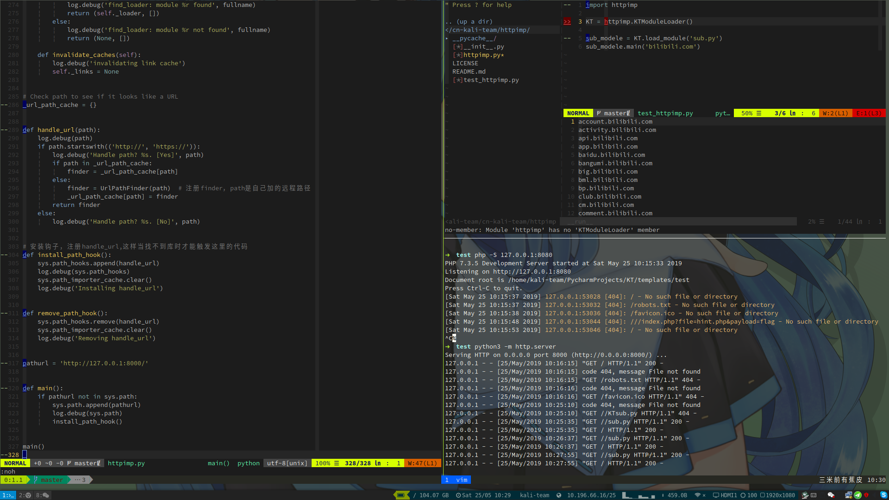

# httpimp
- 远程内存加载Python模块

```python
import httpimp

KT = httpimp.KTModuleLoader()
sub_modele = KT.load_module('sub.py')
sub_modele.main('bilibili.com')
```

- 开启http服务，`python3 -m http.server`



